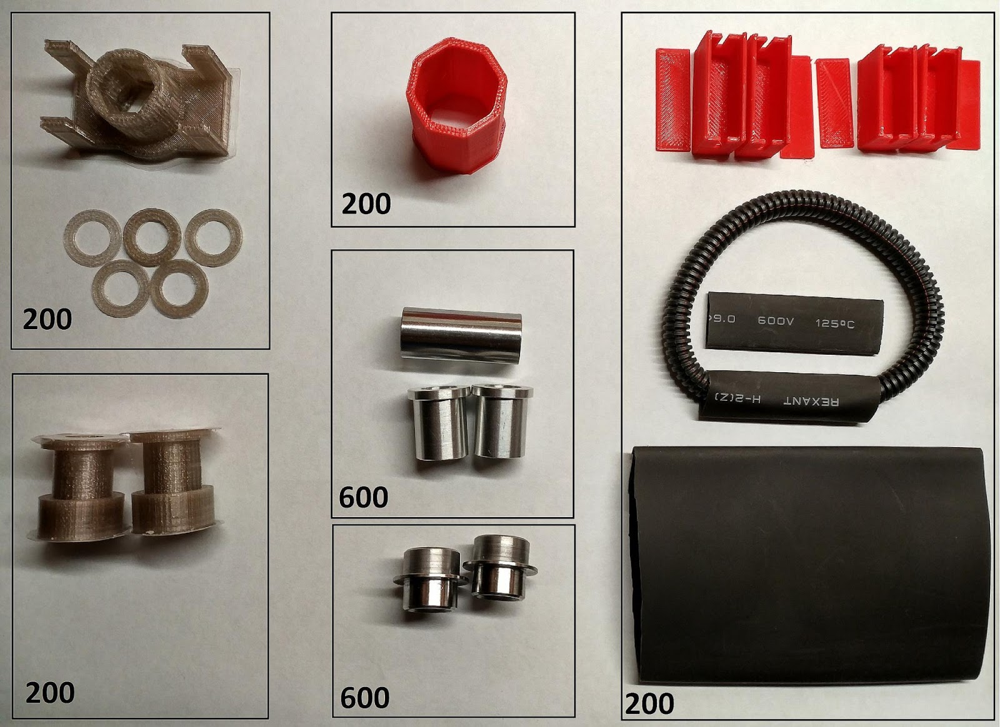

# 2.2. Где взять ремкомплект для самоката?

За ремкомплектом обращаться к Ивану (в телеграме Иван Самокат, на форуме электротранспорта [Ванёг](https://electrotransport.ru/ussr/index.php?action=profile;u=59710))

Информация по установке деталей:

[В телеграмме](https://t.me/Ninebot_ES/7583)

[На электротранспорте](https://electrotransport.ru/ussr/index.php?topic=48865.msg1310745#msg1310745)

Источник: [Перейти](https://electrotransport.ru/ussr/index.php?topic=48865.msg1322371#msg1322371)

Цены на детали (в рублях):

Пластиковые детали можно самостоятельно распечатать на 3д принтере. Модели размещены [здесь](7._STL_модели_для_3d-принтера/README.md)

[На главную](../README.md)