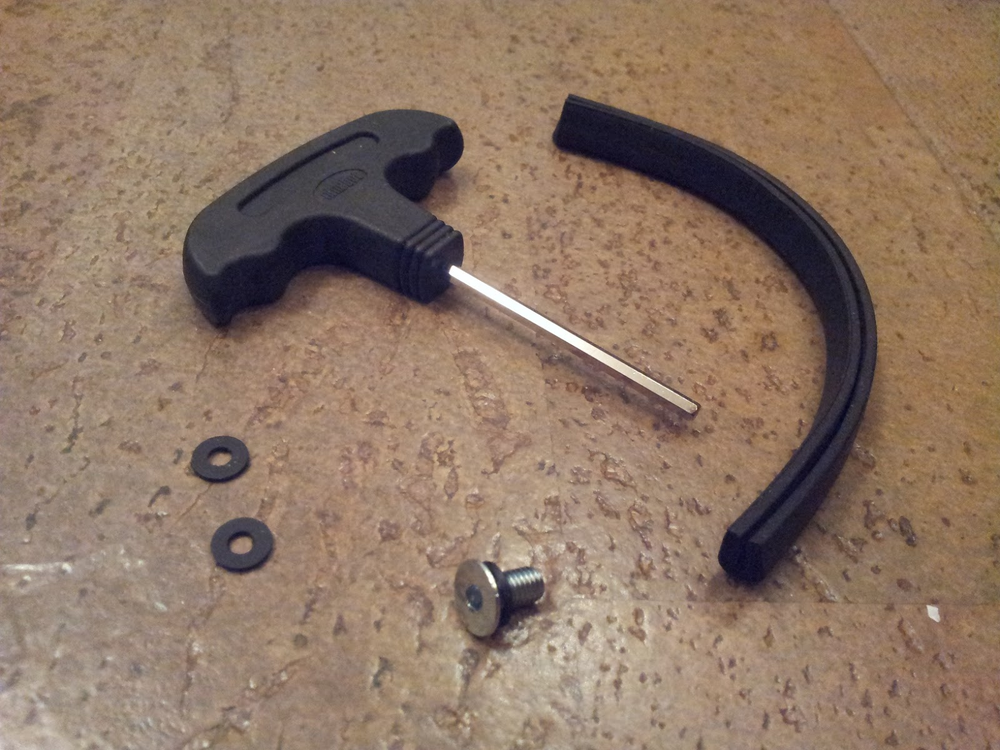

# 2.3. После сборки остались запчасти, что с ними делать?

Источник: [Перейти](https://electrotransport.ru/ussr/index.php?topic=48865.msg1298366#msg1298366)

* Транспортировочная резинка была прикреплена к рулю. Она не нужна (на выброс).
* Болт запасной.

[На главную](../README.md)