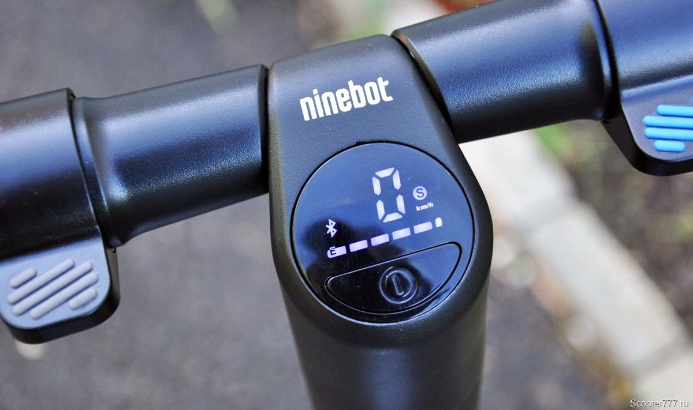

# 2.4. Что лучше, Ninebot ES или Xiaomi Miija?

Ниже указаны основные параметры самокатов. Выбор за Вами :)

Источники данных:

https://electro.club/wiki/elektrosamokat_Xiaomi_Mi_Electric_Scooter_M365

https://electrotransport.ru/ussr/index.php?topic=48865.0#topmsg 

ВИДЕО:

Сравнение Ninebot ES и Xiaomi Miija https://youtu.be/Z5HTBNQ6Zm8 

Обзор электросамоката Ninebot ES2 в сравнении с хитом продаж 2017 года - Xiaomi Mijia 365 https://youtu.be/YsoXVOFZZWk 

| Ninebot ES | Xiaomi Miija |
|------------|--------------|
| Самокат новый. Много нерешенных проблем.  Небольшой выбор аксессуаров | Самокат на рынке второй год. Много решений проблем. Большой выбор аксессуаров. Выпущена вторая версия самоката с исправлением некоторых недочетов первых версий. |
| Возможность установки доп. батареи заводского изготовления. | Установка доп. батареи в только “кустарного” производства с врезкой в электронную начинку и снятием гарантии. |
| Литые покрышки. По сравнению с Xiaomi самокат едет жёстче. | Пневматические покрышки едет мягче, чем Ninebot, но необходимо следить за давлением и есть возможность в дороге проколоть колесо. Так же  есть возможность установки литых покрышек (на данный момент уже 3 поколение). |
| Возможна установка кастомной прошивки для самоката | Возможна установка кастомной прошивки для самоката |
| У Ninebot ES2/4 два узла сочленения деки - узел сложения и амортизатор. | Цельнолитая дека. Возможно более предпочтителен для ездоков более 100 кг. |
| Информативный индикатор на руле. Показывает скорость, заряд батареи, и режим поездки. При зарядке показывает % заряда батареи в цифрах.  | Малоинформативный индикатор на руле. Показывает только заряд батареи и режим поездки.  |
| Более простая и менее эффективная система торможения задним крылом. | Более эффективная, но более требовательная к уходу и регулировке система торможения. |
| Есть дополнительная подсветка в деке.  | |
| | В первых партиях многие самокаты возвращались в гарантийный ремонт. Из-за этого, например, продавцы отказываются продавать самокат с гарантийным ремонтом. |
| Высокий центр тяжести из-за батареи в руле. В разложенном состоянии неустойчив. | Низкий центр тяжести. Лучше управляется. |

| Параметры | Ninebot ES | Xiaomi Miija |
|-----------|------------|--------------|
| Аккумулятор | ES1/2: 187Втч (5.2Ач) (расширяется до 374Втч) ES4: 374Втч (10,4Ач) | M365: 280втч (7.8Ач) M187: 187Втч (5.2Ач) |
| Пробег | ES1/2: 20 км ES4: 35 км | 30 км |
| Макс. скорость | ES1: 20км/ч (с доп. аккумулятором 25км/ч) ES2: 25км/ч ES4: 30км/ч | 25 км/ч |
| Максимальная нагрузка | 100 кг | 100 кг |
| Номинальная мощность двигателя | ES1: 250Вт ES2/4: 300Вт | 250 Вт |
| Максимальная мощность двигателя | ES1: 500Вт ES2: 600Вт ES4: 800Вт | 500 Вт |
| Вес | ES1: 11 кг ES2: 12,5 кг ES4: 14 кг | 12,5 кг |
| Амортизатор | ES1: передний (пружина) ES2/4: передний+задний | нет |

[На главную](../README.md)